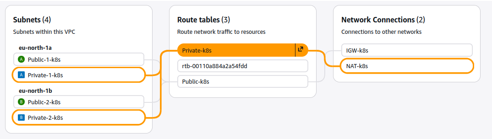
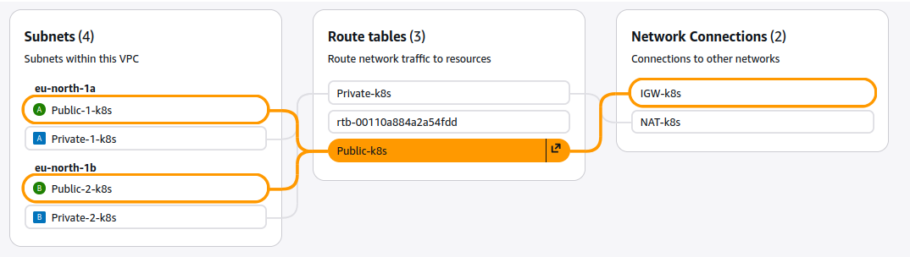
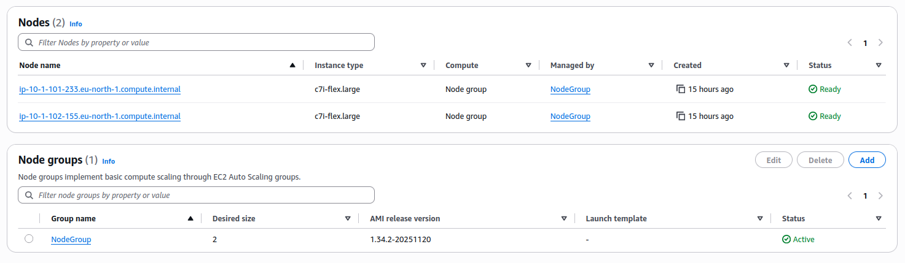
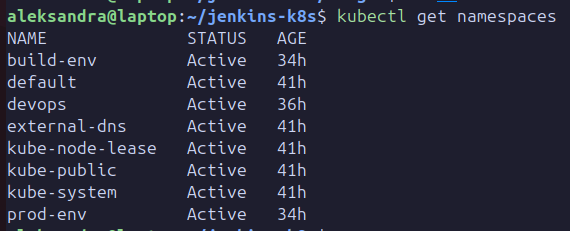
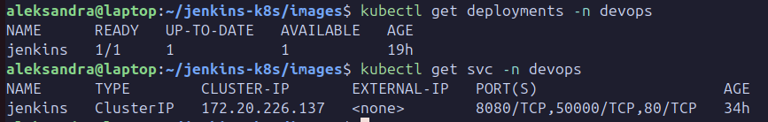
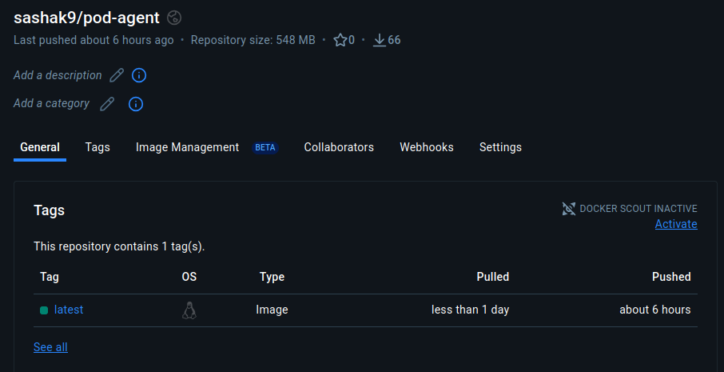
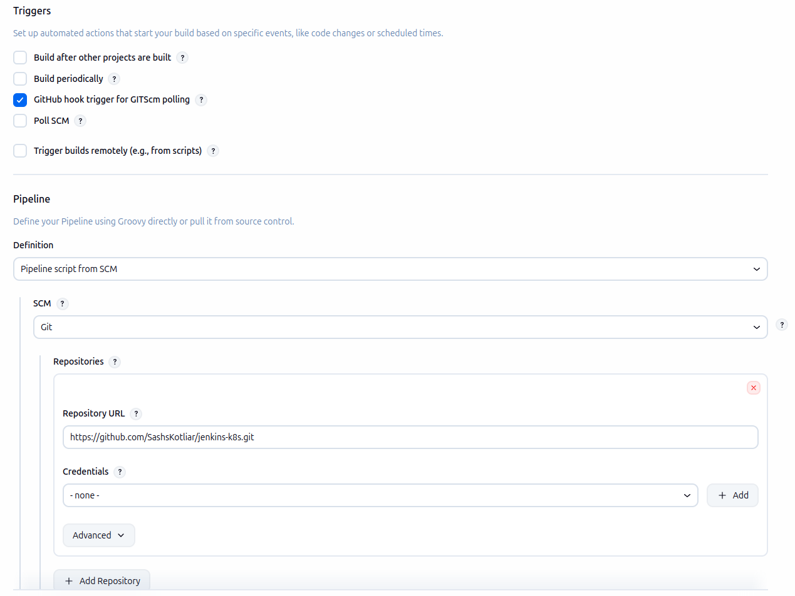
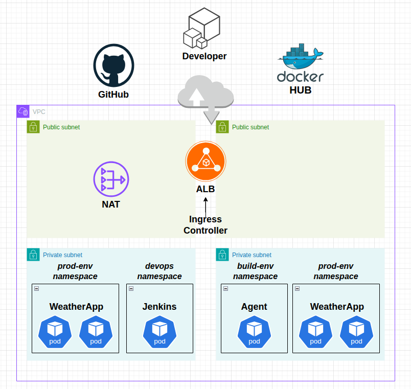

**Jenkins pipeline in Kubernetes cluster.**
1. [Explanation about project folders and files](#explanation-about-project-folders-and-files)
2. [Create VPC](#create-vpc)
3. [Create and configure EKS cluster in your VPC](#create-and-configure-eks-cluster-in-your-vpc)
4. [Create persistent volume for Jenkins](#create-persistent-volume-for-jenkins)
5. [Create Jenkins and Python app in their namespaces](#create-jenkins-and-python-app-in-their-namespaces)
6. [Configure entry point to cluster](#configure-entry-point-to-cluster)
7. [Configure Jenkins](#configure-jenkins)
8. [Create and configure GitHub repository](#create-and-configure-github-repository)
9. [Create a pipeline](#create-a-pipeline)
10. [Project Flow Diagram](#project-flow-diagram)

## Explanation about project folders and files

1. luster-config-files/: cluster configuration (deployments, services, ingress rules, persistent storage files, RBAC role)
2. imageForAgent/: Dockerfile for agent jnlp image
3. images/: screenshots of workflow
4. weatherApp/: application python and html files
5. Dockerfile - application dockerfile
6. Jenkinsfile - pipeline
7. requirements.txt - application dependencies

## Create VPC

1. Create vpc with 2 public and 2 private subnets, NAT gateway (regional) and Internet gateway, 2 routing tables.

2. Add tags to subnets so EKS can know where to place load balancers:
    kubernetes.io/cluster/cluster-name = shared - tag private and public subnets.
    kubernetes.io/role/elb = 1 - tag public subnets.

## Create and configure EKS cluster in your VPC

1. Create EKS cluster: custom configuration, only private subnets to place ENIs in - so cluster's traffic stays in private network within the vpc.
2. Create node group with 2 nodes - one for each private subnet.

3. To allow managing the cluster from a terminal run: 
    aws eks update-kubeconfig --name <cluster-name> --region <region>
4. For creating and mounting volumes, nodes' role must contain this policy: AmazonEFSCSIDriverPolicy
5. Create a namespace devops(for jenkins), build-env (for building image) and prod-env (for python app):
     kubectl create namespace devops, 
     kubectl create namespace build-env, 
     kubectl create namespace prod-env, 
     check:

## Create persistent volume for Jenkins

1. Create EFS in the cluster's vpc (for persistent storage for jenkins).
2. Deploy EFS storage driver: 
    kubectl apply -k "github.com/kubernetes-sigs/aws-efs-csi-driver/deploy/kubernetes/overlays/stable/?ref=master"
3. Create efs storage class file (for dynamic provisioning) and apply it: 
    kubectl apply -f efs-storage-class.yaml 
4. Create Persistent Volume Claim and apply it:
    kubectl apply -f efs-pvc.yaml

## Create Jenkins and Python app in their namespaces

1. Create Jenkins Deployment and service in devops namespace, apply them and check:

2. Create python app Deployment and service in prov-env namespace, apply them and check as in example above.

## Configure entry point to cluster

1. Create ingress rule yaml for each service (Jenkins and Weather app).
2. Apply them:
    kubectl apply -f jenkins-ingress.yaml
    kubectl apply -f weather-ingress.yaml
3. Using aws documentation, install eksctl, helm CLI.
    Install role so ingress controller could provision an ALB dynamically.
    Create a service account and map it to created role, so it could reach aws CLI.
    Using Helm, install AWS load balancer controller in the particular cluster.

    Docs url: https://docs.aws.amazon.com/eks/latest/userguide/lbc-helm.html
    Secure ALB with TLS using AWS certificate and domain (I used Cloudflare for domain).

## Configure Jenkins

1. In jenkins pod's logs look for a password for accessing jenkins:
    kubectl logs pod-name -n devops 
2. Sign in to jenkins, set up the controller, install needed plugins (Kubernetes, Docker, Pipeline, Github, Git).
3. Create service account for jenkins, create and bind a role for it. (Jenkins need permissions to create ephemeral agent pods).
    Use Role and RoleBinding - because we give permissions only for specific namespace for agents - build-env, attach this service account to jenkins.
4. Create a Dockerfile that contains the default image that jenkins uses to run agent pods, install there kubectl, push it to dockerhub registry.

5. In jenkins to Clouds, create new cloud Kubernetes. Give it a name.
    Kubernetes namespace: where we will run agents (build-env).
    Set jenkins url to: http://jenkins.devops.svc.cluster.local:8080 (service.namespace.svc.cluster.local:8080).
6. Configure pod templates: give an agent a name, set namespace to build-env, give agent a label.
    Add container, give it name jnlp - so it will override a default container running in a pod.
    Set image to image you created and pushed to dockerhub.
    Set home directory to: /home/jenkins
    Set it to run in privileged mode.

## Create and configure GitHub repository

1. Create repository in github, configure ssh keys for cloning and pushing files, clone it to the local PC.
2. In github configure a webhook with url: https://jenkins-k8s.skyb.boo

## Create a pipeline

1. Create a new job pipeline, configure it to get GitHub hook trigger for GITScm polling.
    Define pipeline script from SCM.
    Set scm to git, put github repository path, set branch to main.

2. Make a folder with a python app, make requirements file for it, and a dockerfile that builds image.
3. Create credentials for jenkins to push image to dockerhub from a pipeline.
4. Write a pipeline in a Jenkinsfile that:
    builds image via sidecar container
    pushes it to dockerhub
    deploys it to prod-env namespace

## Project Flow Diagram:

    

